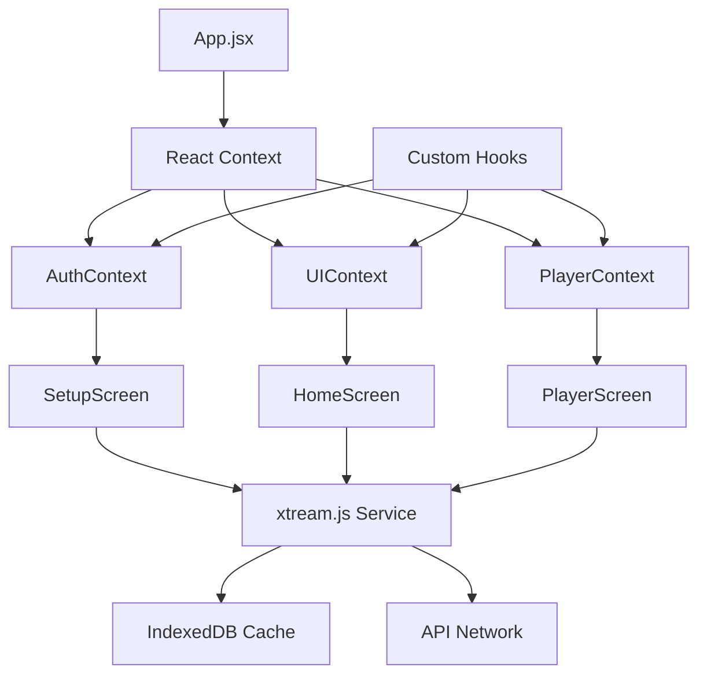

# Aura IPTV - Improvement Plan

## Project Overview
Aura is a modern IPTV client built with React 19, Vite, and Capacitor, supporting Xtream Codes API. The app features glassmorphism UI with Live TV, VOD, and Series streaming capabilities.

---

## 1. Error Handling & Resilience Improvements

### 1.1 Global Error Boundary
- Add React Error Boundary at app root to catch render errors
- Display user-friendly error messages with retry options
- Log errors to console for debugging

### 1.2 API Error Handling
- Improve [`xtream.js`](src/services/xtream.js) error handling with specific error types
- Add retry logic with exponential backoff for failed API calls
- Implement circuit breaker pattern for failing providers

### 1.3 Stream Error Recovery
- Improve [`PlayerScreen.jsx`](src/screens/PlayerScreen.jsx) error handling:
  - Better codec detection and fallback
  - Alternative stream URL generation
  - User notification for different error types

### 1.4 Offline Mode Enhancement
- Better cached content handling when offline
- Queue actions for when connection restores

---

## 2. State Management Improvements

### 2.1 React Context for Global State
Replace prop drilling with React Context:
```jsx
// Create contexts for: Auth, Player, UI
const AuthContext = createContext();
const PlayerContext = createContext();
```

### 2.2 Consider React Query / SWR
Replace manual caching with established library:
- Built-in caching and deduping
- Background refetch
- Optimistic updates
- DevTools support

### 2.3 Persist State Properly
- Use `@react-native-async-storage/async-storage` for mobile
- Better state hydration on app restart
- Persist player state, favorites, and settings

---

## 3. Performance Optimization

### 3.1 Virtualized Lists
Implement `react-window` or `@tanstack/virtual` for:
- [`HomeScreen.jsx`](src/screens/HomeScreen.jsx) - Large stream lists
- [`DetailScreen.jsx`](src/screens/DetailScreen.jsx) - Episode lists
- Category browsing with 1000+ items

### 3.2 Image Optimization
- Add image caching with proper cache policies
- Implement responsive images
- Add blur placeholder for loading images
- Use WebP format when available

### 3.3 Code Splitting
- Lazy load screens: `React.lazy(() => import('./screens/PlayerScreen'))`
- Lazy load heavy components
- Dynamic imports for modals

### 3.4 Memoization
- Add `useMemo` for filtered/sorted lists
- Use `React.memo` for media cards
- Optimize re-renders in lists

---

## 4. Code Organization & Maintainability

### 4.1 Extract Icon Components
Create [`src/components/Icons/`](src/components/Icons/) directory:
- Move all inline SVG icons to separate files
- Use consistent icon sizes via props
- Add icon sprite sheet for bundle optimization

### 4.2 Custom Hooks
Extract reusable logic into hooks:
- `useAuth()` - Authentication state
- `useFavorites()` - Favorites management
- `useWatchHistory()` - History management
- `useSearch()` - Search with debounce
- `useDebounce()` - Already partially implemented

### 4.3 Constants & Config
Create [`src/constants/`](src/constants/):
- API endpoints
- Storage keys
- UI constants (colors, sizes)
- Error messages

### 4.4 Utility Functions
Create [`src/utils/`](src/utils/):
- Formatters (time, date, file size)
- Validators
- Storage helpers

---

## 5. Security Enhancements

### 5.1 Credential Encryption
- **Critical**: Encrypt stored credentials in localStorage
- Use Web Crypto API or `crypto-js`
- Never store passwords in plaintext

### 5.2 Input Validation
- Add validation for URL inputs
- Sanitize user inputs
- Validate API responses

### 5.3 Secure Storage
- Move sensitive data to secure storage (Keychain on iOS, Keystore on Android)
- Consider using Capacitor's secure storage plugin

---

## 6. User Experience Enhancements

### 6.1 Loading States
- Add skeleton screens throughout
- Add shimmer effects
- Improve loading feedback

### 6.2 Empty States
- Add meaningful empty states for:
  - No search results
  - No favorites
  - No history
  - No content in category

### 6.3 Pull-to-Refresh
- Add pull-to-refresh on content screens
- Manual cache refresh option

### 6.4 Search Improvements
- Search history
- Recent searches
- Filter results by type

### 6.5 Player Enhancements
- Gesture controls (swipe to seek, volume)
- Picture-in-picture improvements
- Background audio playback
- Quality selection for streams

---

## 7. Type Safety (TypeScript Migration)

### 7.1 Incremental Migration
1. Add `tsconfig.json` with JSX support
2. Rename files to `.tsx` gradually
3. Add type definitions for:
   - API response types
   - Component props
   - Context types

### 7.2 Type Definitions Needed
```typescript
interface Stream {
  stream_id: number;
  name: string;
  type: 'live' | 'movie' | 'series';
  poster?: string;
  hero?: string;
  // ...
}

interface Credentials {
  url: string;
  username: string;
  password: string;
}
```

---

## 8. Accessibility Improvements

### 8.1 ARIA Labels
- Add `aria-label` to all buttons
- Add `role` attributes where needed
- Add `aria-live` for dynamic content

### 8.2 Keyboard Navigation
- Focus management between screens
- Keyboard shortcuts for player
- Skip navigation links

### 8.3 Screen Reader Support
- Announce player controls
- Describe images with `alt` text
- Proper heading hierarchy

### 8.4 Color & Contrast
- Ensure WCAG AA compliance
- Add high contrast mode
- Test with color blindness

---

## 9. Configuration & Build Improvements

### 9.1 Environment Validation
- Validate required env variables at startup
- Show clear error messages for missing config
- Add `.env.example` file

### 9.2 Build Optimization
- Add proper compression (gzip, brotli)
- Tree shaking optimization
- Bundle analysis

### 9.3 PWA Support
- Add service worker for offline
- Web app manifest
- Add to home screen prompt

### 9.4 Capacitor Plugins
- Add splash screen plugin
- Add status bar plugin
- Add network information plugin

---

## 10. Testing Strategy

### 10.1 Unit Tests
- Test utility functions
- Test custom hooks
- Test components in isolation

### 10.2 Integration Tests
- Test user flows
- Test API integration

### 10.3 E2E Tests
- Test critical paths (login, playback)
- Use Cypress or Playwright

---

## Priority Recommendations

| Priority | Item | Impact |
|----------|------|--------|
| 🔴 High | Credential Encryption | Security |
| 🔴 High | Error Boundaries | Stability |
| 🟠 Medium | Virtualized Lists | Performance |
| 🟠 Medium | TypeScript Migration | Maintainability |
| 🟠 Medium | State Management | Architecture |
| 🟢 Low | Accessibility | Inclusivity |
| 🟢 Low | Testing | Reliability |

---

## Architecture Diagram



---

## Next Steps

1. Start with high-priority items (security, error handling)
2. Add TypeScript incrementally
3. Optimize performance for large content libraries
4. Improve accessibility for broader audience reach
